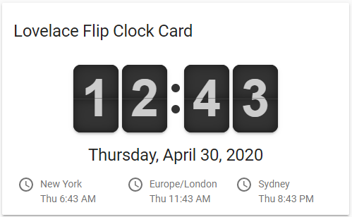

# Lovelace Flip Clock Card 
A minimalistic and customizable flip clock card for [Home Assistant](https://github.com/home-assistant/home-assistant) Lovelace UI.



The flip clock itself is based on the project of [Justin Kimbrell](https://github.com/objectivehtml).

## Install

### 1. HACS

This card is available in [HACS](https://github.com/custom-components/hacs/issues) (Home Assistant Community Store).

### 2. Manual install

1. Download and copy `flipclock-card-bundle.js` from the [latest release](https://github.com/schmallaria/flipclock-card/releases/latest) into your `config/www` directory.

2. Add a reference to `flipclock-card-bundle.js` inside your `ui-lovelace.yaml` or at the top of the *raw config editor UI*:

  ```yaml
  resources:
    - url: /local/flipclock-card-bundle.js?v=0.0.1
      type: module
  ```

### 3. CLI install

1. Move into your `config/www` directory.

2. Grab `flipclock-card-bundle.js`:

  ```
  $ wget https://github.com/schmallaria/flipclock-card/releases/download/v0.0.1/flipclock-card-bundle.js
  ```

3. Add a reference to `flipclock-card-bundle.js` inside your `ui-lovelace.yaml`:

  ```yaml
  resources:
    - url: /local/flipclock-card-bundle.js?v=0.0.1
      type: module
  ```

## Updating

1. Find your `flipclock-card-bundle.js` file in `config/www` or wherever you ended up storing it.

2. Replace the local file with the latest one attached in the [latest release](https://github.com/schmallaria/flipclock-card/releases/latest).

3. Add the new version number to the end of the cards reference url in your `ui-lovelace.yaml` like below:

  ```yaml
  resources:
    - url: /local/flipclock-card-bundle.js?v=0.0.1
      type: module
  ```

*You may need to empty the browsers cache if you have problems loading the updated card.*

## Using the card

### Options

#### Card options
| Name | Type | Default | Since | Description |
|------|----|-------|-----:|-------------|
| type ***(required)*** | string |  | v0.0.1 | `custom:flipclock-card`.
| date | DateOptions |  | v0.0.1 | Adds the date to the card, see [date options](#date-options).
| time | TimeOptions |  | v0.0.1 | Configures the time, see [time options](#time-options).
| timezones | List |  | v0.0.1 | A list of additional timezone id's or a list of timezone objects, see [timezone options](#timezone-options).
| title | string |  | v0.0.1 | Adds title header to the card.

#### Time options
| Name | Type | Default | Since | Description |
|------|----|-------|-----:|-------------|
| face | ClockFace | TwentyFourHourClock | v0.0.1 | The clock face. Default 24 hour clock. See  [clock faces](#clock-faces) for available values.
| showSeconds | boolean  | false | v0.0.1 | True to show the seconds, otherwise false.

#### Date options
| Name | Type | Default | Since | Description |
|------|----|-------|-----:|-------------|
| format | string | TwentyFourHourClock | v0.0.1 | Date format options. [See here](https://developer.mozilla.org/en-US/docs/Web/JavaScript/Reference/Global_Objects/Date/toLocaleDateString) for available options.
| hidden | boolean | false | v0.0.1 | False to show the date, otherwise true.
| locale | string | HASS system language | v0.0.1 | The date language. See [See here](https://developer.mozilla.org/en-US/docs/Web/JavaScript/Reference/Global_Objects/Date/toLocaleDateString) for available value. 

#### Timezone options
| Name | Type | Default | Since | Description |
|------|----|-------|-----:|-------------|
| id | string |  | v0.0.1 | The timezone id. E.g. America/New_York, Europe/Berlin.
| title | string |  | v0.0.1 | An optional string which will be displayed instead of the timezone id.

#### Clock faces
TwentyFourHourClock - displays a 24 hour clock (default)<br/>
TwelveHourClock - displays a 12 hour clock

### Minimal example
Shows the time (24 hour clock) without seconds and the date. The default locale for the date is set to your HASS system language.
```yaml
type: 'custom:flipclock-card'
```

### Full example
A full example which shows all features.
```yaml
type: 'custom:flipclock-card'
time:
  face: TwentyFourHourClock
  showSeconds: true
timezones:
  - id: America/New_York
    title: New York
  - id: Australia/Sydney
    title: Sydney
  - Europe/London
title: Lovelace Flip Clock Card
date:
  hidden: false
  locale: de
  format:
    weekday: long
    day: numeric
    month: long
    year: numeric
```

## Credits

- [Justin Kimbrell](https://github.com/objectivehtml) for his awesome FlipClock project.